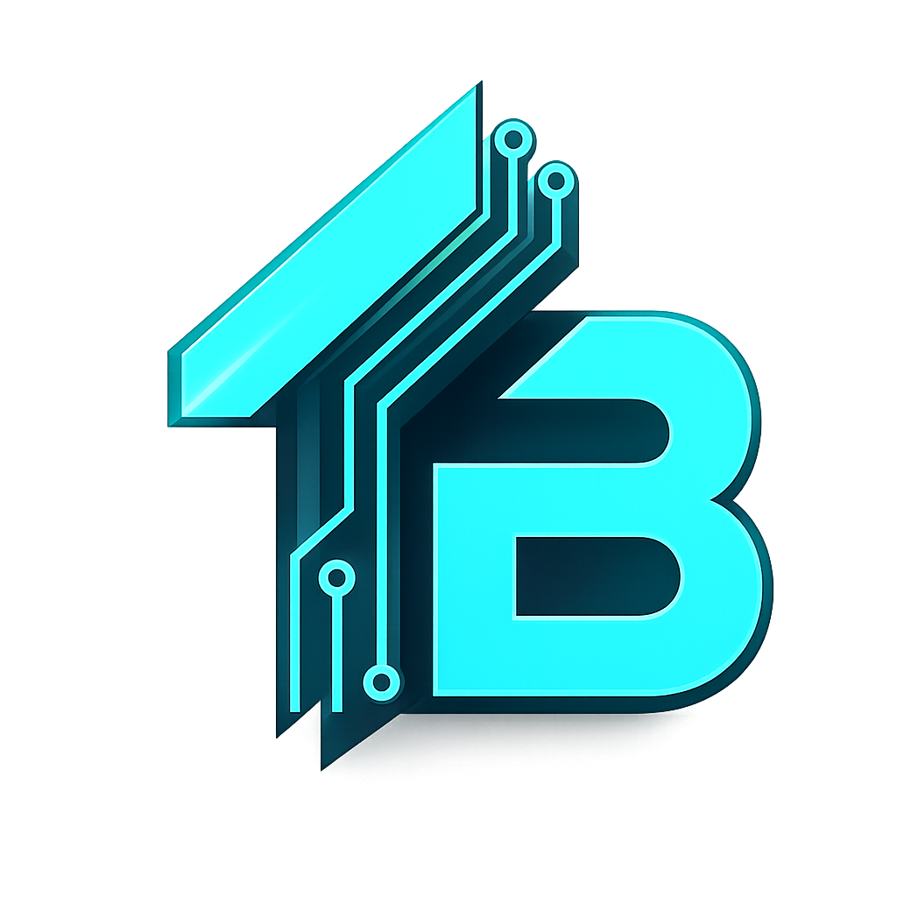
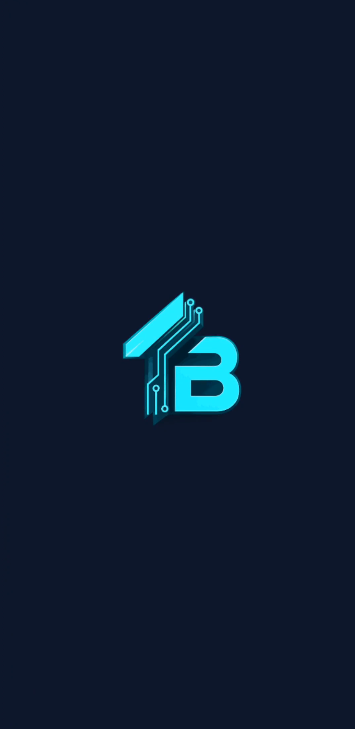
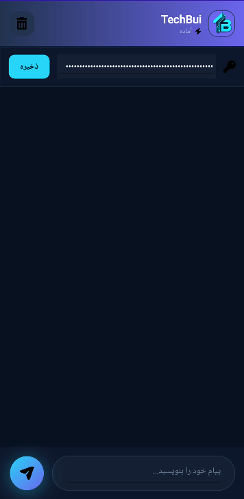
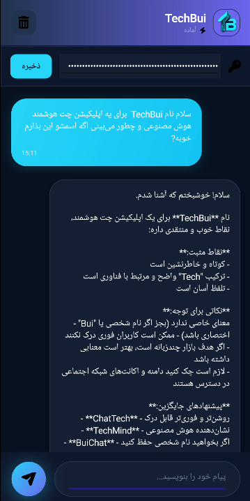

<div align="center">



# 🤖 TechBui - AI Chat Assistant

**A modern, cross-platform AI chatbot powered by Claude API & .NET MAUI**

[](https://dotnet.microsoft.com/en-us/apps/maui)
[](https://learn.microsoft.com/en-us/dotnet/csharp/)
[](https://freemodel.dev)
[](LICENSE)
[]()

</div>

---

## 📸 Screenshots         

<div align="center">

| Main Chat | Dark UI | Dark1 UI |
|:---------:|:-------:|:-------:|
|  |  |  |

</div>


## ✨ Features

- 🎨 **Premium Dark UI** with Glassmorphism & Neon Accents
- 🤖 **AI-Powered** using Claude Sonnet, Opus & Haiku models
- 🌍 **Bilingual Support** - Persian (Farsi) & English
- 📱 **Cross-Platform** - Windows, Android, iOS
- 💬 **Smart Fallback System** - Auto-switches between 5 AI models & 2 API formats
- 🔑 **Secure API Key Storage** using device Preferences
- 🎯 **Right-to-Left (RTL)** support for Persian language
- ⚡ **Auto Fallback** - If one model fails, tries 9 other combinations
- 📝 **Conversation History** with smooth animations
- 🗑️ **Clear Chat** functionality
- 🔄 **Retry Mechanism** for failed requests
- 🎨 **Modern UI** with gradients, shadows & custom SVG icons

---

## 📦 Supported AI Models

| Model | Speed | Quality |
|-------|-------|---------|
| `claude-sonnet-5` | 🚀 Fast | ⭐ Excellent |
| `claude-sonnet-4-6` | 🚀 Fast | ⭐ Very Good |
| `claude-opus-4-7` | 🐢 Slow | 🧠 Best |
| `claude-haiku-4-5` | ⚡ Fastest | 👌 Good |
| `auto` | 🔄 Auto | 🎲 Dynamic |

---

## 🚀 Getting Started

### Prerequisites

- [.NET 9 SDK](https://dotnet.microsoft.com/download/dotnet/9.0)
- [Visual Studio 2022](https://visualstudio.microsoft.com/vs/) with .NET MAUI workload
- [FreeModel.dev API Key](https://freemodel.dev) (Free Tier available)

### Installation

1. Clone the repository:
```bash
git clone https://github.com/mamadmamadu11-dotcom/TechBui.git
cd TechBui
```

2. Open in Visual Studio 2022:
```
Open TechBui.sln
```

3. Build and Run:
```
Build > Rebuild Solution
Press F5 to run
```

4. Get API Key:
- Visit [freemodel.dev](https://freemodel.dev)
- Sign up and create an API key (starts with `fe_oa_`)
- Enter the key in the app

---

## 🏗️ Project Structure

```
TechBui/
├── Models/
│   └── ChatMessage.cs          # Data models
├── Services/
│   └── ChatService.cs          # AI API integration with fallback
├── ViewModels/
│   └── ChatViewModel.cs        # MVVM ViewModel
├── Helpers/
│   └── InvertBoolConverter.cs  # XAML converter
├── Resources/
│   ├── AppIcon/                # App icons
│   ├── Splash/                 # Splash screen
│   ├── Images/                 # Logo & SVG icons
│   └── Fonts/                  # Custom fonts
├── Platforms/                  # Android, iOS, Windows
├── MainPage.xaml               # Main chat UI
├── MainPage.xaml.cs            # Code-behind
├── App.xaml                    # App resources
├── MauiProgram.cs              # DI configuration
└── TechBui.csproj              # Project config
```

---

## 🎨 Customization

### Change Color Theme
Edit in `MainPage.xaml`:
```xml
<GradientStop Color="#36E4F4" Offset="0.0"/>  <!-- Cyan -->
<GradientStop Color="#6C5CE7" Offset="1.0"/>  <!-- Purple -->
```

### Change AI Model Priority
Edit in `Services/ChatService.cs`:
```csharp
private readonly string[] _modelFallbackList = new string[]
{
    "claude-sonnet-5",
    "claude-sonnet-4-6",
    // Add more models...
};
```

---

## 👨‍💻 Author

**MohammadReza Ghanbari**

[](https://instagram.com/techbui)
[](mailto:mamadmamadu11@gmail.com)
[](tel:09930533371)

---

## 📝 License

MIT License - see [LICENSE](LICENSE) file

---

## ⭐ Support

If you like this project, give it a **star** ⭐ and share it!

<div align="center">

**Built with ❤️ for the developer community**

</div>
